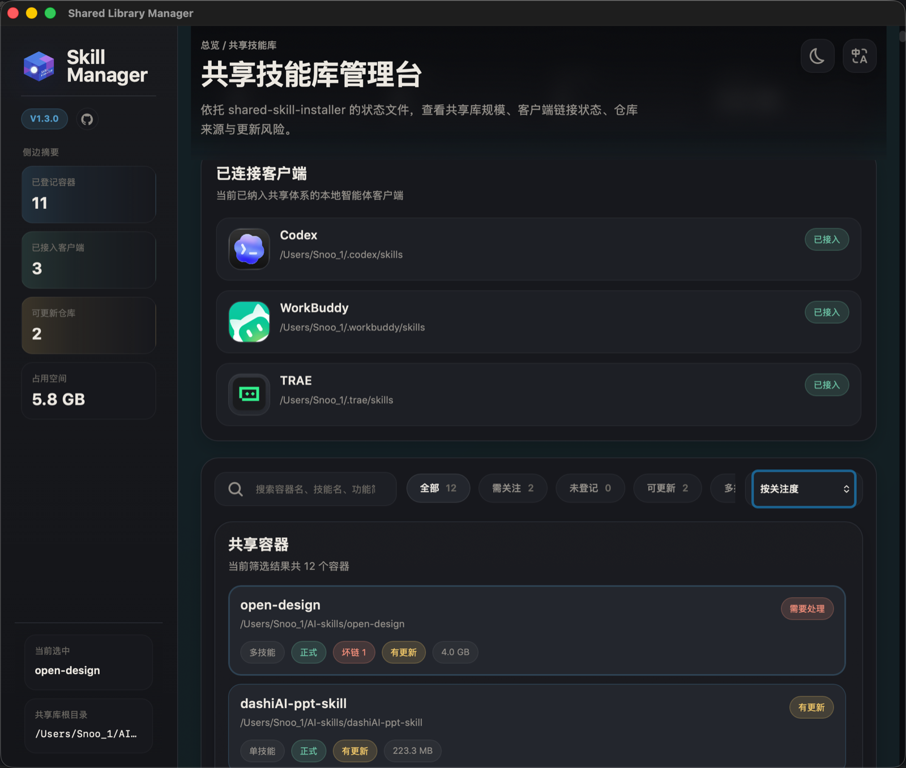

# shared-skill-installer

一个共享 skill 安装器。它把 GitHub 或本地 skill 统一放进一个共享库，再同步给多个本地智能体客户端使用。

A shared skill installer that stores GitHub or local skills in one shared library, then exposes them to multiple local AI clients.

Current integrated release: `V1.3.1`

V1.3.1 keeps the V1.3.0 shared-library and manager upgrades, and further stabilizes the manager across browser mode and the local app shell:

- automatic adoption of older local skills that already exist in `AI-skills` but were never registered into shared state
- shared-library reconciliation that can repair missing client links while refreshing the full library
- duplicate skill-name detection that prevents older stray folders from hijacking an existing shared entry
- a bundled `Shared Library Manager` local dashboard inside the skill package itself
- consistent local-app-shell packaging and reopen flow for the manager on macOS
- improved official client icon extraction and tighter manager layout behavior at smaller window sizes

---

## 中文说明

### 🆕 V1.3.1 这次更新了什么



- 旧的本地 skill 如果已经在 `AI-skills` 里，但没写进 `.shared-skill-state/*.skillmap.tsv`，现在可以被自动纳管
- 刷新共享库时，会顺带修复缺失的客户端入口，而不是只处理已登记 skill
- 如果旧目录里存在和正式 skill 同名的重复项，`V1.3.1` 会识别并跳过这类冲突纳管，避免抢占现有入口
- 技能包里正式内置了 `Shared Library Manager` 可视化管理台，不再只是独立原型
- 技能管理台左上角加入版本号与 GitHub 仓库跳转图标，方便查看当前版本和来源
- 管理台里为“未登记本地 skill”提供了单独入口，不会再被埋在普通列表里
- 管理台会优先从本机已安装客户端的官方应用包里提取图标并本地引用，后续新增 Cursor、Claude 等客户端也沿用这套机制
- 修复 `SKILL.md` 多行 frontmatter 描述被错误显示为 `>` 或 `|` 的问题，技能介绍读取更稳定
- macOS 首次安装后会自动生成 `Shared Library Manager.app`，用户以后可以像打开本地应用一样重新进入管理台
- 管理台脚本现在会优先打开这个本地壳应用，找不到时再回退到浏览器模式
- 浏览器静态页与本地客户端壳的能力边界已明确区分：像“更改共享库位置”这类动作只在具备本地 API 的模式里显示
- 管理台顶部交互、图标提取、客户端重开流程和本地壳应用打包链路做了进一步收口，减少“功能修好了但入口状态不一致”的情况

常用的 `V1.3.1` 维护命令：

```bash
./scripts/install-shared-skill --reconcile-library
./scripts/open-shared-library-manager.sh
```

### ⚡ 新手快速开始

如果你是第一次安装 `shared-skill-installer`，直接用默认位置即可，不需要先理解底层结构。

标准中文口令：

```text
请帮我安装这个仓库：https://github.com/SnooZou/shared-skill-installer 。请使用默认本地位置创建共享技能库，并自动接入我本地已安装的智能体客户端，共用这套共享技能库。
```

- 仓库地址：[https://github.com/SnooZou/shared-skill-installer](https://github.com/SnooZou/shared-skill-installer)
- 默认共享技能库位置：
  - macOS / Linux：`~/AI-skills`
  - Windows：`%USERPROFILE%\\AI-skills`

上面这句中文口令已经够用，普通用户不需要理解命令行安装步骤。

如果你想自定义共享库位置：

```text
请帮我安装这个仓库：https://github.com/SnooZou/shared-skill-installer 。安装前请先让我选择共享技能库位置：使用默认位置、从常用位置里选一个，或者由我自己指定。确认后再自动完成安装，并接入我本地已安装的智能体客户端。
```

建议智能体先用中文给用户一个简短选择，而不是直接让用户填写路径写法。推荐提问方式：

- `默认位置（推荐）`：`~/AI-skills`
- `桌面`：在桌面创建共享技能库
- `文档`：在“文稿 / Documents”里创建共享技能库
- `我自己指定`：再让我补充位置

安装完成后，重启 Codex、WorkBuddy、TRAE 等本地智能体客户端一次即可。

---

### ✨ 它解决什么问题


- 所有本地 skill 统一放在一个位置管理
- 多个智能体共用同一套 skill，不需要重复安装
- 新 skill 完整入库，避免分散和丢文件
- 减少重复维护，也减少本地空间浪费

---

### 💬 安装完成后怎么调用

下面这些内容只适用于：`shared-skill-installer` 已经安装完成之后。

#### 不同智能体的调用方式

##### Codex

- 常见写法：`$shared-skill-installer`


##### WorkBuddy

- 常见写法：输入并选中 `shared-skill-installer` 技能标签


##### TRAE

- 常见写法：`/shared-skill-installer`


#### 直接可复制的中文口令

安装 GitHub skill：

```text
请使用 $shared-skill-installer，把你要安装的 GitHub skill 完整安装到我的共享技能库，并同步给所有本地智能体使用。安装的 GitHub skill 地址为：https://github.com/xxx/xxxx/...
```

安装本地 skill：

```text
请使用 $shared-skill-installer，把你要安装的本地 skill 完整入库到我的共享技能库，并同步给所有本地智能体使用。我自己的本地 skill 存放路径为：/xxx/xxxx/xxx...
```

安装多 skill 仓库：

```text
请使用 $shared-skill-installer，把你要安装的多 skill 仓库完整导入我的共享技能库，并刷新所有本地智能体入口。安装的 GitHub 仓库地址为：https://github.com/xxx/xxxx/...
```

验证是否生效：

```text
请使用 $shared-skill-installer，验证这个共享 skill 是否已在所有配置客户端中生效。
```

---

### 📦 后续怎么安装新的 Skill

装好 `shared-skill-installer` 之后，后续新增 skill 都走同一套规则：

1. 先完整入库到共享库
2. 再同步给所有本地智能体

常见场景：

- GitHub skill：发你自己的 GitHub skill 链接给智能体
- 本地 skill：发你自己的本地路径给智能体
- 多 skill 仓库：发你自己的仓库路径给智能体；容器名默认沿用仓库或文件夹名称，无需先写死

命令行备用方式：

```bash
./scripts/run-install.sh --repo xxx/xxxx --path your-skill-path
./scripts/run-install.sh --local /path/to/your-local-skill
./scripts/run-install.sh --bundle-local /path/to/your-multi-skill-repo
```

---

### ➕ 新增本地智能体客户端

如果你想把新的本地智能体也接入共享 skill 体系，直接在已经接入共享库的任意一个智能体里发送下面这句：

```text
请使用 $shared-skill-installer，自动识别我本机已安装的、支持本地 skill 的智能体客户端，把它们统一接入我的共享技能库，并刷新所有共享 skill 入口。
```

这句口令的目标是尽量不让用户自己去找路径。只有在某个客户端支持本地 skill、但又没有被自动识别时，才需要再补充它的名称和本地 skill 目录路径。

---

### ✅ 长期使用建议

- 新 skill 一律优先完整入库到共享库
- 不要在每个智能体目录里各装一份
- 新增客户端时，优先直接使用新增客户端的一键式口令
- 如果你机器里已经有一批旧 skill，升级到 `V1.3.1` 后先执行一次共享库重整流程

### 🖥 Shared Library Manager

`V1.3.1` 继续内置本地可视化管理台，并把它封装成可重开的本地壳应用入口。

- 本地入口：`manager/index.html`
- 刷新数据：`./scripts/build-shared-library-manager.sh`
- 一键准备并打开入口路径：`./scripts/open-shared-library-manager.sh`
- macOS 假本地应用：`~/Applications/Shared Library Manager.app`
- 构建壳应用：`./scripts/build-shared-library-manager-app.sh`
- 客户端图标提取：`./scripts/extract-client-icons.py`

它会显示：

- 当前共享库里有哪些 skill / 仓库
- 哪些是正式登记项，哪些是未登记但已存在的本地 skill
- 管理台可直接按“未登记”筛选这些本地 skill
- Codex、WorkBuddy、TRAE 等客户端是否全部接好入口
- 已安装客户端如果本机存在官方应用图标，管理台会优先使用提取后的本地图标
- 哪些仓库可能有更新，哪些 skill 缺少客户端链接

---

## English Guide

### 🆕 What V1.3.1 Adds


- Older local skills already living in `AI-skills` can now be adopted even if they were never registered into `.shared-skill-state/*.skillmap.tsv`
- Library refresh can now repair missing client links instead of only handling already indexed skills
- Duplicate skill names are now detected so an older stray folder does not silently overwrite an existing shared entry point
- The package now bundles the `Shared Library Manager` dashboard directly
- The dashboard sidebar now shows the package version and a GitHub repository shortcut icon
- The macOS local app-shell packaging flow is now more stable and easier to reopen after installation
- Static browser mode and local API-backed manager mode now expose the right actions more consistently
- Official local client icon extraction has been tightened so client avatars fill the manager cards more reliably

Common V1.3.1 maintenance commands:

```bash
./scripts/install-shared-skill --reconcile-library
./scripts/open-shared-library-manager.sh
```

### ⚡ Quick Start

If this is your first time installing `shared-skill-installer`, use the default location and avoid overthinking the structure.

Standard English prompt:

```text
Please help me install this repository: https://github.com/SnooZou/shared-skill-installer . Please create the shared skill library in the default local location, then automatically connect my locally installed AI clients so they can share this skill library.
```

- Repository: [https://github.com/SnooZou/shared-skill-installer](https://github.com/SnooZou/shared-skill-installer)
- Default shared library location:
  - macOS / Linux: `~/AI-skills`
  - Windows: `%USERPROFILE%\\AI-skills`

The prompt above is enough for most users. They do not need to understand the command-line bootstrap flow.

If you want a custom shared library location:

```text
Please help me install this repository: https://github.com/SnooZou/shared-skill-installer . Before installing, first let me choose where the shared skill library should live: use the default location, pick from common locations, or let me specify one myself. After that, automatically finish the installation and connect my locally installed AI clients.
```

The AI client should offer a short plain-language choice first instead of making the user write path syntax. Recommended choices:

- `Default location (Recommended)`: `~/AI-skills`
- `Desktop`: create the shared library on the desktop
- `Documents`: create the shared library inside Documents
- `Let me choose`: ask me for a custom location

After installation, restart Codex, WorkBuddy, TRAE, or any other local AI client once.

---

### ✨ What It Solves


- Keeps all local skills in one managed place
- Lets multiple AI clients share the same skill library
- Preserves full source trees instead of scattering partial files
- Reduces duplicate installs, maintenance work, and local storage waste

---

### 💬 How To Invoke It After Installation

Everything below assumes `shared-skill-installer` is already installed.

#### Client-specific invocation

##### Codex

- Common pattern: `$shared-skill-installer`


##### WorkBuddy

- Common pattern: type and select the `shared-skill-installer` skill chip


##### TRAE

- Common pattern: `/shared-skill-installer`


#### Copy-ready English prompts

Install a GitHub skill:

```text
Use $shared-skill-installer to fully install the GitHub skill I want into my shared skill library and sync it to all local AI clients. The GitHub skill URL is: https://github.com/xxx/xxxx/...
```

Install a local skill:

```text
Use $shared-skill-installer to fully import the local skill I want into my shared skill library and sync it to all local AI clients. My local skill path is: /xxx/xxxx/xxx...
```

Install a multi-skill repository:

```text
Use $shared-skill-installer to fully import the multi-skill repository I want into my shared skill library and refresh all local AI client entries. The GitHub repository URL is: https://github.com/xxx/xxxx/...
```

Verify that a shared skill is active:

```text
Use $shared-skill-installer to verify whether this shared skill is active in every configured client.
```

---

### 📦 How To Add New Skills Later

Once `shared-skill-installer` is installed, every new skill follows the same rule:

1. Fully import it into the shared library
2. Sync it to all local AI clients

Common cases:

- GitHub skill: send your own GitHub skill URL to the AI client
- Local skill: send your own local folder path
- Multi-skill repository: send your own repo path; the container name usually follows the repo or folder name by default

Command-line fallback:

```bash
./scripts/run-install.sh --repo xxx/xxxx --path your-skill-path
./scripts/run-install.sh --local /path/to/your-local-skill
./scripts/run-install.sh --bundle-local /path/to/your-multi-skill-repo
```

---

### ➕ Adding Another Local AI Client

To connect another local AI client to the same shared skill system, send this one-click prompt from any AI client that is already connected to the shared library:

```text
Use $shared-skill-installer to automatically detect the AI clients already installed on this machine that support local skill directories, connect them to my shared skill library, and refresh all shared skill entries.
```

This prompt is designed to avoid making the user hunt for local paths. Only if a client supports local skills but is not detected automatically should you ask for its name and local skill directory path.

---

### ✅ Recommended Ongoing Workflow

- Always import new skills into the shared library first
- Do not install separate copies into every client folder
- When you add another client, prefer the one-click client-onboarding prompt
