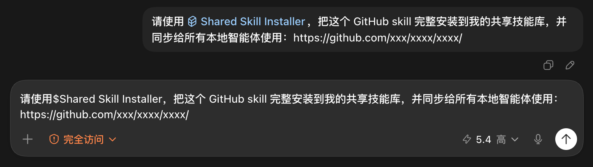
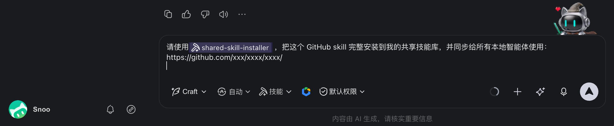
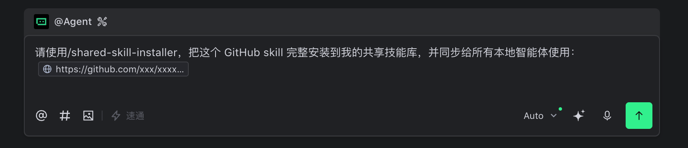
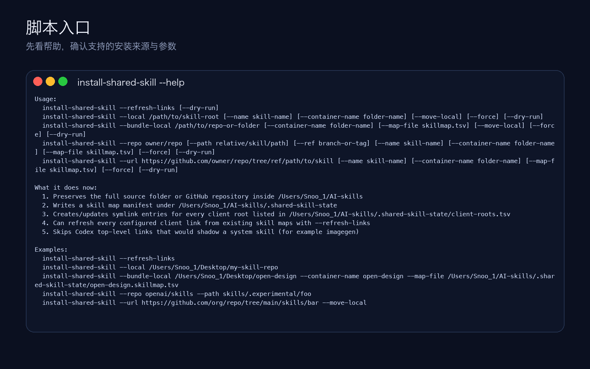
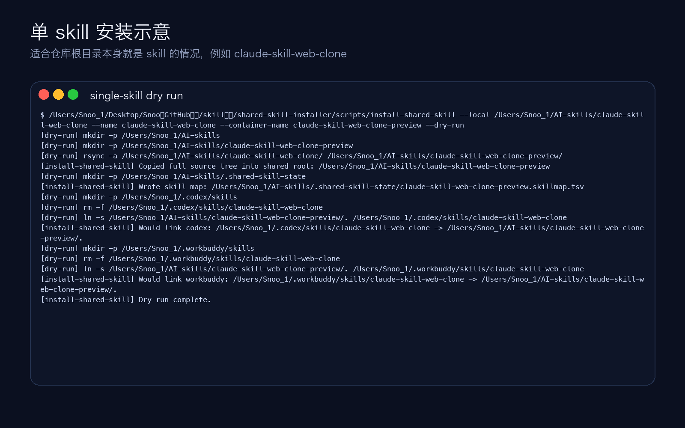
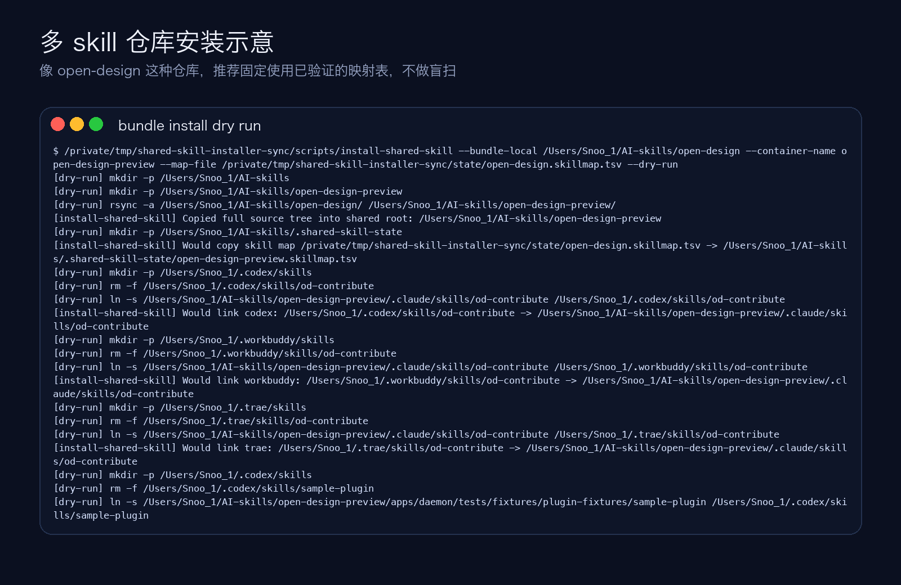
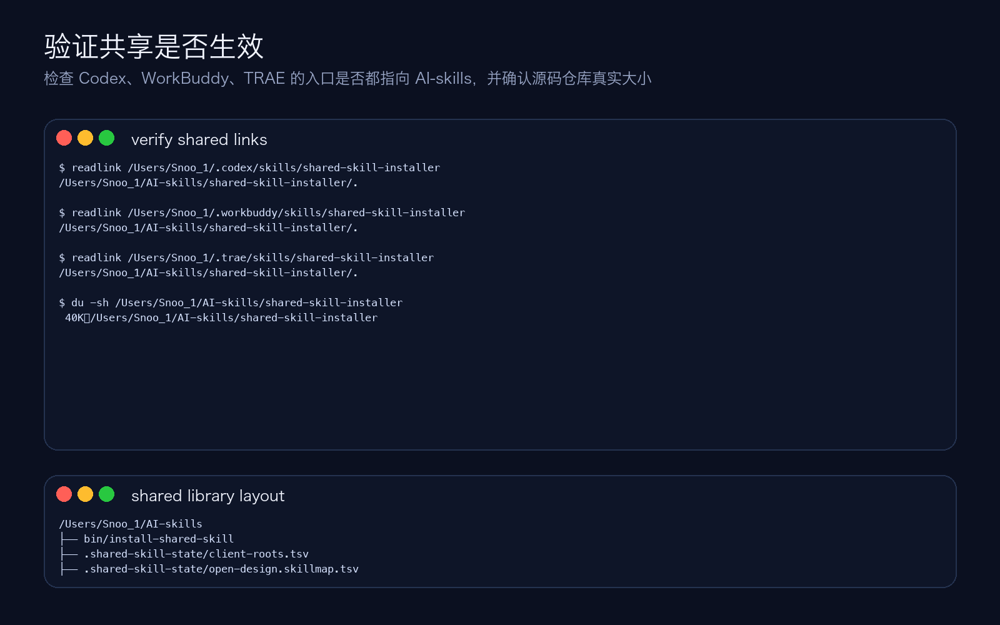
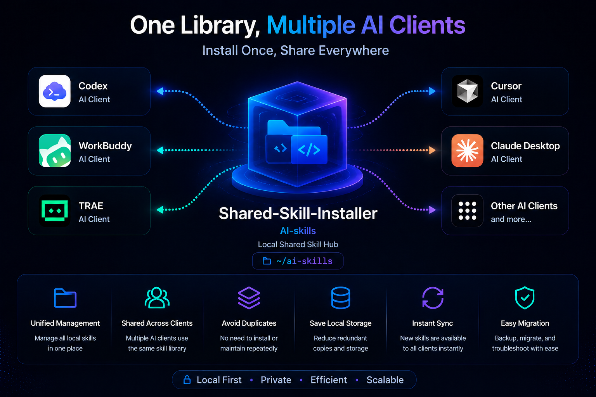

# shared-skill-installer

一个可复用的共享 skill 安装器模板。它会把 GitHub 或本地 skill 完整放进一个共享库，再通过软链接分发给多个本地智能体客户端。

A reusable shared-skill installer template. It keeps the full source of a GitHub or local skill in one shared library, then exposes it to multiple local AI clients through symlinks.

---

## 中文说明

### 📥 下载

这一节告诉新用户去哪里下载、怎么直接拿到仓库。

- GitHub 仓库：[https://github.com/SnooZou/shared-skill-installer](https://github.com/SnooZou/shared-skill-installer)
- Git 克隆：

```bash
git clone https://github.com/SnooZou/shared-skill-installer.git
```

- ZIP 下载：[https://github.com/SnooZou/shared-skill-installer/archive/refs/heads/main.zip](https://github.com/SnooZou/shared-skill-installer/archive/refs/heads/main.zip)

---

### ✨ 它解决什么问题

这一节帮助读者先理解“为什么要用它”，再往下看安装和使用方法。


- 只保留一份共享源码库，避免同一个 skill 在多个智能体目录里重复安装
- 新 skill 默认完整入库，不做删减，尽量保留原始源码结构
- 支持单个 skill 文件夹、多 skill 仓库、GitHub skill 路径
- 一个 skill 可同时共享给 Codex、WorkBuddy、TRAE，以及后续新增的本地客户端
- 新增客户端后，可一键重建全部 skill 入口

---

### 🗂️ 默认目录

这一节说明共享库默认会放在哪里，以及它会管理哪些核心文件。

默认共享库位置：

```text
${HOME}/AI-skills
```

默认会管理这些路径：

```text
${HOME}/AI-skills/
├── bin/install-shared-skill
├── .shared-skill-state/
│   ├── client-roots.tsv
│   ├── shared-skill-installer.skillmap.tsv
│   └── ...other skill maps...
└── shared-skill-installer/
```

默认客户端目录模板：

```text
codex	${HOME}/.codex/skills
workbuddy	${HOME}/.workbuddy/skills
trae	${HOME}/.trae/skills
```

客户端配置文件：

- [`state/client-roots.tsv`](./state/client-roots.tsv)

---

### 🚀 新用户首次安装

这一节是第一次上手的主流程，按顺序做完就能把共享 skill 机制跑起来。

#### 第 1 步：下载仓库

```bash
git clone https://github.com/SnooZou/shared-skill-installer.git
cd shared-skill-installer
```

#### 第 2 步：初始化共享库

```bash
./scripts/bootstrap.sh
```

这一步会：

- 创建 `${HOME}/AI-skills`
- 把本仓库安装到 `${HOME}/AI-skills/shared-skill-installer`
- 写入 `${HOME}/AI-skills/.shared-skill-state/client-roots.tsv`
- 给已配置客户端创建 `shared-skill-installer` 的软链接入口

如果你想改共享库位置：

```bash
SHARED_ROOT=/your/path/AI-skills ./scripts/bootstrap.sh
```

#### 第 3 步：重启本地智能体

如果 Codex、WorkBuddy、TRAE 没有自动刷新 skill，请重启一次。

---

### 💬 首次在智能体里怎么调用

这一节专门解决“装好以后第一句该怎么说”，并展示不同智能体之间的调用差异。

下面这些话可以直接复制给智能体。

#### 不同智能体的调用示意

不同本地智能体触发共享 skill 的写法会有一点差异，下面这三张截图可以直接对照着用。

##### Codex

- 常见写法：`$shared-skill-installer`
- 也可以在输入框里选中对应 skill 后再发送



##### WorkBuddy

- 常见写法：输入并选中 `shared-skill-installer` 技能标签
- 重点是让输入框里出现已选中的 skill 标签



##### TRAE

- 常见写法：`/shared-skill-installer`
- 通常以前导 `/` 调用本地 skill



#### 中文口令

```text
请使用 $shared-skill-installer，把这个 GitHub skill 完整安装到我的共享技能库，并同步给所有本地智能体使用：https://github.com/owner/repo/tree/main/path/to/skill
```

```text
请使用 $shared-skill-installer，把这个本地 skill 完整入库到 AI-skills，并让 Codex、WorkBuddy、TRAE 共用：/path/to/skill
```

```text
请使用 $shared-skill-installer，把这个多 skill 仓库完整导入共享库，容器名叫 open-design，并刷新所有客户端入口：/path/to/open-design
```

```text
请使用 $shared-skill-installer，把新的本地客户端加入共享列表并刷新全部 skill 入口：客户端名=my-client，目录=~/.my-client/skills
```

---

### 📦 安装完成后，如何继续安装新的开源 Skill

这一节回答最核心的后续问题：共享机制装好之后，今后新的开源 skill 该怎么继续装。

是的，这个项目的目标之一，就是让你在完成首次安装后，后续都通过同一个共享 skill 来安装新的开源 skill。

#### 场景 1：安装 GitHub 上的单个 skill

如果对方给你的是一个 GitHub skill 链接，直接把链接发给智能体即可。

```text
请使用 $shared-skill-installer，把这个 GitHub skill 完整安装到我的共享技能库，并同步给所有本地智能体使用：https://github.com/owner/repo/tree/main/path/to/skill
```

#### 场景 2：安装你本地已经下载好的 skill

如果你已经把开源 skill 下载到本地，就把本地路径发给智能体。

```text
请使用 $shared-skill-installer，把这个本地 skill 完整入库到 AI-skills，并让 Codex、WorkBuddy、TRAE 共用：/path/to/skill
```

#### 场景 3：安装一个包含很多子 skill 的仓库

像 `open-design` 这种多 skill 仓库，应该把整个仓库作为一个容器完整导入共享库。

```text
请使用 $shared-skill-installer，把这个多 skill 仓库完整导入共享库，容器名叫 open-design，并刷新所有客户端入口：/path/to/open-design
```

#### 安装后怎么确认成功

安装完成后，建议做两件事：

1. 看共享库里是否已经出现完整 skill 文件夹
2. 让安装器刷新或验证客户端入口

验证口令：

```text
请使用 $shared-skill-installer，验证这个共享 skill 是否已在所有配置客户端中生效。
```

命令行验证：

```bash
./scripts/verify-shared-links.sh skill-name
```

#### 后续使用规则

以后每次新增 skill，统一遵循这一条：

- 先完整入库到 `~/AI-skills`
- 再自动给各个本地智能体建立入口

---

### 🛠️ 常用命令

这一节适合已经理解流程、只想快速找到命令的人。

#### 安装单个本地 skill

```bash
./scripts/run-install.sh --local /path/to/skill-root
```

#### 把本地 skill 移入共享库

```bash
./scripts/run-install.sh --local /path/to/skill-root --move-local
```

#### 从 GitHub 安装

```bash
./scripts/run-install.sh --repo owner/repo --path path/to/skill
```

#### 导入多 skill 仓库

```bash
./scripts/run-install.sh \
  --bundle-local /path/to/open-design \
  --container-name open-design \
  --map-file ./state/open-design.skillmap.tsv
```

#### 重建所有客户端软链接

```bash
./scripts/install-shared-skill --refresh-links
```

适用场景：

- 新增了一个客户端目录
- 迁移到新机器
- 本地客户端 skill 目录被清空或替换

#### 验证某个共享 skill

```bash
./scripts/verify-shared-links.sh shared-skill-installer
```

---

### ➕ 新增本地智能体客户端

这一节讲的是如何把新的本地智能体也接进同一个共享 skill 体系。

1. 编辑 [`state/client-roots.tsv`](./state/client-roots.tsv)
2. 新增一行：

```text
my-client	${HOME}/.my-client/skills
```

3. 刷新全部入口：

```bash
./scripts/install-shared-skill --refresh-links
```

---

### ✅ 推荐流程固化

这一节把长期使用时最推荐的操作规则固定下来，避免后续又装回分散目录。

以后新 skill 推荐统一按下面流程处理：

1. 先把 skill 的完整源码放进共享库，不要只抽取部分文件
2. 再通过软链接分发给各个智能体客户端
3. 新增客户端时，只改 `client-roots.tsv` 并执行一次 `--refresh-links`

---

### 🖼️ 教程截图

这一节放的是教程示意图，帮助新用户通过视觉方式快速理解操作流程。

#### 1. 总览


#### 2. 帮助信息



#### 3. 单 skill 安装



#### 4. 多 skill 仓库导入



#### 5. 共享链接验证



---

### 🔄 重新生成教程截图

如果你调整了文档示例或想更新示意图，可以用这一节里的命令重新生成截图。

```bash
./scripts/regenerate-docs.sh
```

---

### 📚 仓库内容

这一节给维护者一个总览，方便快速找到脚本、状态文件和文档资源。

```text
shared-skill-installer/
├── README.md
├── SKILL.md
├── agents/openai.yaml
├── docs/
│   ├── generate_readme_screens.py
│   └── screenshots/
├── scripts/
│   ├── bootstrap.sh
│   ├── install-shared-skill
│   ├── regenerate-docs.sh
│   ├── run-install.sh
│   └── verify-shared-links.sh
└── state/
    ├── client-roots.tsv
    ├── open-design.skillmap.tsv
    └── shared-skill-installer.skillmap.tsv
```

---

## English Guide

### 📥 Download

This section tells new users where to download the project and how to get the repository quickly.

- Repository: [https://github.com/SnooZou/shared-skill-installer](https://github.com/SnooZou/shared-skill-installer)
- Clone:

```bash
git clone https://github.com/SnooZou/shared-skill-installer.git
```

- Download ZIP: [https://github.com/SnooZou/shared-skill-installer/archive/refs/heads/main.zip](https://github.com/SnooZou/shared-skill-installer/archive/refs/heads/main.zip)

---

### ✨ What It Solves

This section helps readers understand why the project exists before they move into setup and usage.



- Keeps one shared source of truth for local skills
- Preserves full source trees instead of trimming files during install
- Supports single-skill folders, multi-skill repositories, and GitHub skill paths
- Shares the same skill with Codex, WorkBuddy, TRAE, and future local clients
- Rebuilds all client links with one refresh command

---

### 🗂️ Default Layout

This section explains where the shared library lives by default and which core files it manages.

Default shared library root:

```text
${HOME}/AI-skills
```

By default the template manages:

```text
${HOME}/AI-skills/
├── bin/install-shared-skill
├── .shared-skill-state/
│   ├── client-roots.tsv
│   ├── shared-skill-installer.skillmap.tsv
│   └── ...other skill maps...
└── shared-skill-installer/
```

Default client roots template:

```text
codex	${HOME}/.codex/skills
workbuddy	${HOME}/.workbuddy/skills
trae	${HOME}/.trae/skills
```

Client config file:

- [`state/client-roots.tsv`](./state/client-roots.tsv)

---

### 🚀 First-Time Setup

This is the main first-run workflow. Follow it in order to get the shared skill system working.

#### Step 1: Get the repository

```bash
git clone https://github.com/SnooZou/shared-skill-installer.git
cd shared-skill-installer
```

#### Step 2: Bootstrap the shared library

```bash
./scripts/bootstrap.sh
```

This will:

- Create `${HOME}/AI-skills`
- Install this repository into `${HOME}/AI-skills/shared-skill-installer`
- Write `${HOME}/AI-skills/.shared-skill-state/client-roots.tsv`
- Create the `shared-skill-installer` entry in each configured client root

If you want a different shared root:

```bash
SHARED_ROOT=/your/path/AI-skills ./scripts/bootstrap.sh
```

#### Step 3: Restart your local AI clients

Restart Codex, WorkBuddy, TRAE, or any other configured client if they do not hot-reload skills.

---

### 💬 First Prompts To Use In Your AI Client

This section focuses on what to say after setup and shows the small invocation differences between clients.

You can paste these directly into your AI client.

#### Client-specific invocation examples

Different local AI clients trigger the shared skill a little differently. Use these screenshots as a quick visual guide.

##### Codex

- Common pattern: `$shared-skill-installer`
- You can also select the matching skill in the composer before sending


##### WorkBuddy

- Common pattern: type and select the `shared-skill-installer` skill chip
- The important part is that the selected skill tag appears in the composer


##### TRAE

- Common pattern: `/shared-skill-installer`
- TRAE typically invokes local skills with a leading `/`


#### English prompts

```text
Use $shared-skill-installer to install this GitHub skill into my shared skill library and expose it to all local AI clients: https://github.com/owner/repo/tree/main/path/to/skill
```

```text
Use $shared-skill-installer to import this local skill into AI-skills and share it with Codex, WorkBuddy, and TRAE: /path/to/skill
```

```text
Use $shared-skill-installer to import this multi-skill repository into the shared library under the container name open-design, then refresh all client links: /path/to/open-design
```

```text
Use $shared-skill-installer to add a new local client and rebuild every shared skill link: client=my-client, root=~/.my-client/skills
```

---

### 📦 After Setup: How To Install New Open-Source Skills

This section answers the main follow-up question: once the shared setup is ready, how do you keep installing new open-source skills?

Yes. One of the main goals of this project is that, after the first setup, you keep using the same shared skill to install future open-source skills.

#### Scenario 1: Install a single GitHub skill

If someone gives you a GitHub skill URL, paste that URL directly into your AI client.

```text
Use $shared-skill-installer to install this GitHub skill into my shared skill library and expose it to all local AI clients: https://github.com/owner/repo/tree/main/path/to/skill
```

#### Scenario 2: Install a local skill you already downloaded

If you already downloaded the skill locally, send the local folder path to your AI client.

```text
Use $shared-skill-installer to import this local skill into AI-skills and share it with Codex, WorkBuddy, and TRAE: /path/to/skill
```

#### Scenario 3: Install a multi-skill repository

For a multi-skill repository such as `open-design`, import the full repository as one container into the shared library.

```text
Use $shared-skill-installer to import this multi-skill repository into the shared library under the container name open-design, then refresh all client links: /path/to/open-design
```

#### How To Confirm It Worked

After installation, do these two checks:

1. Confirm the full skill folder now exists inside `~/AI-skills`
2. Refresh or verify client links

Verification prompt:

```text
Use $shared-skill-installer to verify whether this shared skill is active in every configured client.
```

Command-line verification:

```bash
./scripts/verify-shared-links.sh skill-name
```

#### Ongoing Rule

For every future skill, follow this rule:

- First store the full source in `~/AI-skills`
- Then expose it to each local AI client through links

---

### 🛠️ Common Commands

This section is for readers who already understand the workflow and just want the right command quickly.

#### Install a single local skill

```bash
./scripts/run-install.sh --local /path/to/skill-root
```

#### Move a local skill into the shared library

```bash
./scripts/run-install.sh --local /path/to/skill-root --move-local
```

#### Install from GitHub

```bash
./scripts/run-install.sh --repo owner/repo --path path/to/skill
```

#### Install a multi-skill repository

```bash
./scripts/run-install.sh \
  --bundle-local /path/to/open-design \
  --container-name open-design \
  --map-file ./state/open-design.skillmap.tsv
```

#### Rebuild links for every configured client

```bash
./scripts/install-shared-skill --refresh-links
```

Use this after:

- adding a new client root
- restoring a machine
- replacing client-side skill folders

#### Verify one shared skill

```bash
./scripts/verify-shared-links.sh shared-skill-installer
```

---

### ➕ Adding Another Local AI Client

This section explains how to connect another local AI client to the same shared skill system.

1. Edit [`state/client-roots.tsv`](./state/client-roots.tsv)
2. Add one line:

```text
my-client	${HOME}/.my-client/skills
```

3. Re-run:

```bash
./scripts/install-shared-skill --refresh-links
```

---

### ✅ Recommended Ongoing Workflow

This section locks in the recommended long-term workflow so future installs do not drift back into scattered client folders.

For future skills, the recommended workflow is:

1. First keep the full source tree in the shared library instead of extracting only selected files
2. Then expose it to each local AI client through symlinks
3. When you add another client, update `client-roots.tsv` and run `--refresh-links`

---

### 🖼️ Tutorial Screenshots

This section contains tutorial screenshots so new users can understand the workflow visually.

#### 1. Overview


#### 2. Help


#### 3. Single skill install


#### 4. Multi-skill repository install


#### 5. Shared link verification


---

### 🔄 Regenerate The Docs Screenshots

If you update the docs examples or want to refresh the tutorial visuals, use this command to regenerate the screenshots.

```bash
./scripts/regenerate-docs.sh
```

---

### 📚 Repository Contents

This section gives maintainers a quick map of the repository so they can find scripts, state files, and docs assets fast.

```text
shared-skill-installer/
├── README.md
├── SKILL.md
├── agents/openai.yaml
├── docs/
│   ├── generate_readme_screens.py
│   └── screenshots/
├── scripts/
│   ├── bootstrap.sh
│   ├── install-shared-skill
│   ├── regenerate-docs.sh
│   ├── run-install.sh
│   └── verify-shared-links.sh
└── state/
    ├── client-roots.tsv
    ├── open-design.skillmap.tsv
    └── shared-skill-installer.skillmap.tsv
```
