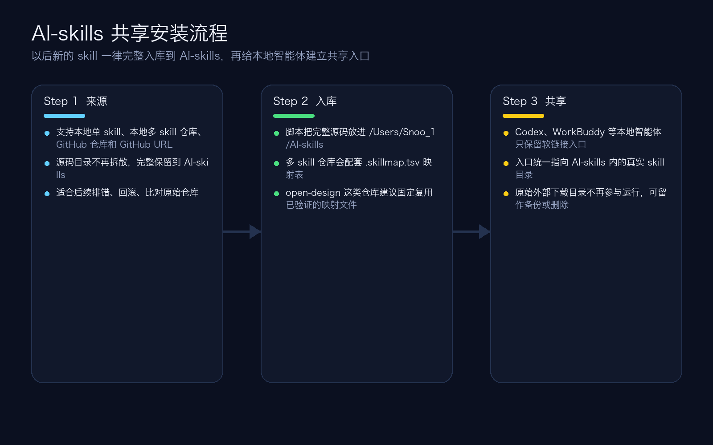

# shared-skill-installer

一个可复用的共享 skill 安装器模板。它会把 GitHub 或本地 skill 完整放进一个共享库，再通过软链接分发给多个本地智能体客户端。

A reusable shared-skill installer template. It keeps the full source of a GitHub or local skill in one shared library, then exposes it to multiple local AI clients through symlinks.

## 下载 / Download

- GitHub 仓库 / Repository: [https://github.com/SnooZou/shared-skill-installer](https://github.com/SnooZou/shared-skill-installer)
- Git 克隆 / Clone:

```bash
git clone https://github.com/SnooZou/shared-skill-installer.git
```

- ZIP 下载 / Download ZIP: [https://github.com/SnooZou/shared-skill-installer/archive/refs/heads/main.zip](https://github.com/SnooZou/shared-skill-installer/archive/refs/heads/main.zip)

## 它解决什么问题 / What It Solves

- 只保留一份共享源码库，避免同一个 skill 在多个智能体目录里重复安装
- 新 skill 默认完整入库，不做删减，尽量保留原始源码结构
- 支持单个 skill 文件夹、多 skill 仓库、GitHub skill 路径
- 一个 skill 可同时共享给 Codex、WorkBuddy、TRAE，以及后续新增的本地客户端
- 新增客户端后，可一键重建全部 skill 入口

- Keeps one shared source of truth for local skills
- Preserves full source trees instead of trimming files during install
- Supports single-skill folders, multi-skill repositories, and GitHub skill paths
- Shares the same skill with Codex, WorkBuddy, TRAE, and future local clients
- Rebuilds all client links with one refresh command

## 默认目录 / Default Layout

默认共享库位置 / Default shared library root:

```text
${HOME}/AI-skills
```

默认会管理这些路径 / By default the template manages:

```text
${HOME}/AI-skills/
├── bin/install-shared-skill
├── .shared-skill-state/
│   ├── client-roots.tsv
│   ├── shared-skill-installer.skillmap.tsv
│   └── ...other skill maps...
└── shared-skill-installer/
```

默认客户端目录模板 / Default client roots template:

```text
codex	${HOME}/.codex/skills
workbuddy	${HOME}/.workbuddy/skills
trae	${HOME}/.trae/skills
```

客户端配置文件 / Client config file:

- [`state/client-roots.tsv`](./state/client-roots.tsv)

## 新用户首次安装 / First-Time Setup

### 第 1 步：下载仓库 / Step 1: Get the repository

```bash
git clone https://github.com/SnooZou/shared-skill-installer.git
cd shared-skill-installer
```

### 第 2 步：初始化共享库 / Step 2: Bootstrap the shared library

```bash
./scripts/bootstrap.sh
```

这一步会 / This will:

- 创建 `${HOME}/AI-skills`
- 把本仓库安装到 `${HOME}/AI-skills/shared-skill-installer`
- 写入 `${HOME}/AI-skills/.shared-skill-state/client-roots.tsv`
- 给已配置客户端创建 `shared-skill-installer` 的软链接入口

- Create `${HOME}/AI-skills`
- Install this repository into `${HOME}/AI-skills/shared-skill-installer`
- Write `${HOME}/AI-skills/.shared-skill-state/client-roots.tsv`
- Create the `shared-skill-installer` entry in each configured client root

如果你想改共享库位置 / If you want a different shared root:

```bash
SHARED_ROOT=/your/path/AI-skills ./scripts/bootstrap.sh
```

### 第 3 步：重启本地智能体 / Step 3: Restart your local AI clients

如果 Codex、WorkBuddy、TRAE 没有自动刷新 skill，请重启一次。

Restart Codex, WorkBuddy, TRAE, or any other configured client if they do not hot-reload skills.

## 首次在智能体里怎么调用 / First Prompts To Use In Your AI Client

下面这些话可以直接复制给智能体。  
You can paste these directly into your AI client.

### 不同智能体的调用示意 / Client-specific invocation examples

不同本地智能体触发共享 skill 的写法会有一点差异，下面这三张截图可以直接对照着用。

Different local AI clients trigger the shared skill a little differently. Use these screenshots as a quick visual guide.

#### Codex

- 常见写法：`$shared-skill-installer`
- 也可以在输入框里选中对应 skill 后再发送

- Common pattern: `$shared-skill-installer`
- You can also select the matching skill in the composer before sending


#### WorkBuddy

- 常见写法：输入并选中 `shared-skill-installer` 技能标签
- 重点是让输入框里出现已选中的 skill 标签

- Common pattern: type and select the `shared-skill-installer` skill chip
- The important part is that the selected skill tag appears in the composer


#### TRAE

- 常见写法：`/shared-skill-installer`
- 通常以前导 `/` 调用本地 skill

- Common pattern: `/shared-skill-installer`
- TRAE typically invokes local skills with a leading `/`


### 中文口令 / Chinese prompts

```text
请使用 $shared-skill-installer，把这个 GitHub skill 完整安装到我的共享技能库，并同步给所有本地智能体使用：https://github.com/owner/repo/tree/main/path/to/skill
```

```text
请使用 $shared-skill-installer，把这个本地 skill 完整入库到 AI-skills，并让 Codex、WorkBuddy、TRAE 共用：/path/to/skill
```

```text
请使用 $shared-skill-installer，把这个多 skill 仓库完整导入共享库，容器名叫 open-design，并刷新所有客户端入口：/path/to/open-design
```

```text
请使用 $shared-skill-installer，把新的本地客户端加入共享列表并刷新全部 skill 入口：客户端名=my-client，目录=~/.my-client/skills
```

### English prompts

```text
Use $shared-skill-installer to install this GitHub skill into my shared skill library and expose it to all local AI clients: https://github.com/owner/repo/tree/main/path/to/skill
```

```text
Use $shared-skill-installer to import this local skill into AI-skills and share it with Codex, WorkBuddy, and TRAE: /path/to/skill
```

```text
Use $shared-skill-installer to import this multi-skill repository into the shared library under the container name open-design, then refresh all client links: /path/to/open-design
```

```text
Use $shared-skill-installer to add a new local client and rebuild every shared skill link: client=my-client, root=~/.my-client/skills
```

## 安装完成后，如何继续安装新的开源 Skill / After Setup: How To Install New Open-Source Skills

是的，这个项目的目标之一，就是让你在完成首次安装后，后续都通过同一个共享 skill 来安装新的开源 skill。

Yes. One of the main goals of this project is that, after the first setup, you keep using the same shared skill to install future open-source skills.

### 场景 1：安装 GitHub 上的单个 skill / Scenario 1: Install a single GitHub skill

如果对方给你的是一个 GitHub skill 链接，直接把链接发给智能体即可。

If someone gives you a GitHub skill URL, paste that URL directly into your AI client.

```text
请使用 $shared-skill-installer，把这个 GitHub skill 完整安装到我的共享技能库，并同步给所有本地智能体使用：https://github.com/owner/repo/tree/main/path/to/skill
```

```text
Use $shared-skill-installer to install this GitHub skill into my shared skill library and expose it to all local AI clients: https://github.com/owner/repo/tree/main/path/to/skill
```

### 场景 2：安装你本地已经下载好的 skill / Scenario 2: Install a local skill you already downloaded

如果你已经把开源 skill 下载到本地，就把本地路径发给智能体。

If you already downloaded the skill locally, send the local folder path to your AI client.

```text
请使用 $shared-skill-installer，把这个本地 skill 完整入库到 AI-skills，并让 Codex、WorkBuddy、TRAE 共用：/path/to/skill
```

```text
Use $shared-skill-installer to import this local skill into AI-skills and share it with Codex, WorkBuddy, and TRAE: /path/to/skill
```

### 场景 3：安装一个包含很多子 skill 的仓库 / Scenario 3: Install a multi-skill repository

像 `open-design` 这种多 skill 仓库，应该把整个仓库作为一个容器完整导入共享库。

For a multi-skill repository such as `open-design`, import the full repository as one container into the shared library.

```text
请使用 $shared-skill-installer，把这个多 skill 仓库完整导入共享库，容器名叫 open-design，并刷新所有客户端入口：/path/to/open-design
```

```text
Use $shared-skill-installer to import this multi-skill repository into the shared library under the container name open-design, then refresh all client links: /path/to/open-design
```

### 安装后怎么确认成功 / How To Confirm It Worked

安装完成后，建议做两件事：

After installation, do these two checks:

1. 看共享库里是否已经出现完整 skill 文件夹  
   Confirm the full skill folder now exists inside `~/AI-skills`
2. 让安装器刷新或验证客户端入口  
   Refresh or verify client links

验证口令 / Verification prompt:

```text
请使用 $shared-skill-installer，验证这个共享 skill 是否已在所有配置客户端中生效。
```

```text
Use $shared-skill-installer to verify whether this shared skill is active in every configured client.
```

命令行验证 / Command-line verification:

```bash
./scripts/verify-shared-links.sh skill-name
```

### 后续使用规则 / Ongoing Rule

以后每次新增 skill，统一遵循这一条：

For every future skill, follow this rule:

- 先完整入库到 `~/AI-skills`
- 再自动给各个本地智能体建立入口

- First store the full source in `~/AI-skills`
- Then expose it to each local AI client through links

## 常用命令 / Common Commands

### 安装单个本地 skill / Install a single local skill

```bash
./scripts/run-install.sh --local /path/to/skill-root
```

### 把本地 skill 移入共享库 / Move a local skill into the shared library

```bash
./scripts/run-install.sh --local /path/to/skill-root --move-local
```

### 从 GitHub 安装 / Install from GitHub

```bash
./scripts/run-install.sh --repo owner/repo --path path/to/skill
```

### 导入多 skill 仓库 / Install a multi-skill repository

```bash
./scripts/run-install.sh \
  --bundle-local /path/to/open-design \
  --container-name open-design \
  --map-file ./state/open-design.skillmap.tsv
```

### 重建所有客户端软链接 / Rebuild links for every configured client

```bash
./scripts/install-shared-skill --refresh-links
```

适用场景 / Use this after:

- 新增了一个客户端目录
- 迁移到新机器
- 本地客户端 skill 目录被清空或替换

- adding a new client root
- restoring a machine
- replacing client-side skill folders

### 验证某个共享 skill / Verify one shared skill

```bash
./scripts/verify-shared-links.sh shared-skill-installer
```

## 新增本地智能体客户端 / Adding Another Local AI Client

1. 编辑 / Edit [`state/client-roots.tsv`](./state/client-roots.tsv)
2. 新增一行 / Add one line:

```text
my-client	${HOME}/.my-client/skills
```

3. 刷新全部入口 / Re-run:

```bash
./scripts/install-shared-skill --refresh-links
```

## 推荐流程固化 / Recommended Ongoing Workflow

以后新 skill 推荐统一按下面流程处理：

For future skills, the recommended workflow is:

1. 先把 skill 的完整源码放进共享库，不要只抽取部分文件  
   First keep the full source tree in the shared library instead of extracting only selected files.
2. 再通过软链接分发给各个智能体客户端  
   Then expose it to each local AI client through symlinks.
3. 新增客户端时，只改 `client-roots.tsv` 并执行一次 `--refresh-links`  
   When you add another client, update `client-roots.tsv` and run `--refresh-links`.

## 教程截图 / Tutorial Screenshots

### 1. 总览 / Overview



### 2. 帮助信息 / Help


### 3. 单 skill 安装 / Single skill install


### 4. 多 skill 仓库导入 / Multi-skill repository install


### 5. 共享链接验证 / Shared link verification


## 重新生成教程截图 / Regenerate The Docs Screenshots

```bash
./scripts/regenerate-docs.sh
```

## 仓库内容 / Repository Contents

```text
shared-skill-installer/
├── README.md
├── SKILL.md
├── agents/openai.yaml
├── docs/
│   ├── generate_readme_screens.py
│   └── screenshots/
├── scripts/
│   ├── bootstrap.sh
│   ├── install-shared-skill
│   ├── regenerate-docs.sh
│   ├── run-install.sh
│   └── verify-shared-links.sh
└── state/
    ├── client-roots.tsv
    ├── open-design.skillmap.tsv
    └── shared-skill-installer.skillmap.tsv
```
